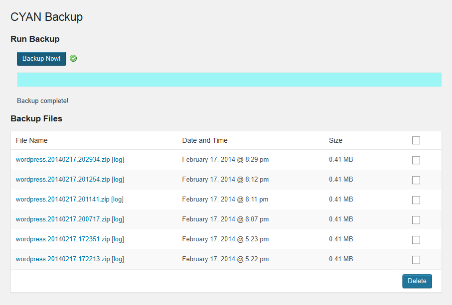
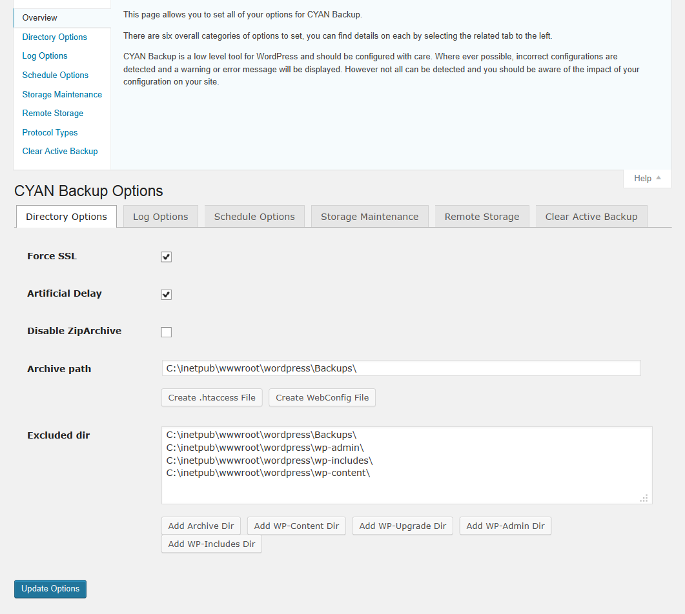
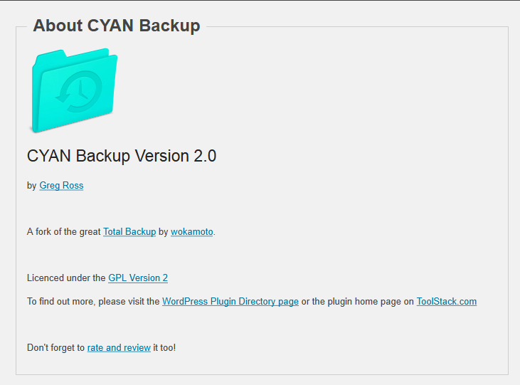

# CYAN Backup #
**Contributors:** [gregross](https://profiles.wordpress.org/gregross/)  
**Plugin URI:** http://toolstack.com/cyan-backup  
**Author URI:** http://toolstack.com  
**Tags:** Backup, Schedule, FTP, SFTP, SCP, FTPS, remote storage  
**Requires at least:** 2.9  
**Tested up to:** 6.4  
**Stable tag:** 2.5.2  
**License:** GPLv2 or later  
**License URI:** http://www.gnu.org/licenses/gpl-2.0.html  

Backup your entire WordPress site and its database into a zip file on a schedule.  Remote storage options include FTP, SFTP and FTPS.

## Description ##

Backup your entire WordPress site and its database into a zip file on a schedule.  Remote storage options include FTP, SFTP and FTPS.

CYAN Backup is a fork of the great [Total Backup](http://wordpress.org/plugins/total-backup/) by [wokamoto](http://profiles.wordpress.org/wokamoto/).

Currently support schedules are hourly, daily, weekly and monthly with intervals for each (for example you could select a schedule of every 4 hours or every 6 weeks, etc.).

**PHP5 Required**

### Localization ###

CYAN Backup is fully ready to be translated in to any supported languages, if you have translated into your language, please let me know.

### Usage ###

Configure the archive path which specifies the directory to store your backups to.  This must be writeable by the web server but should not be accessible via the web as a hacker could guess the filename and get a copy copy of your database.  If you must place the backups in a directory inside of the WordPress directory (or web server root) make sure to block extenal access via .htaccess or other means.  The default path is the directory for the temp files returned by sys_get_temp_dir().

Configure the excluded paths which specify the directories you don't want to back up.  The default excluded directories are:

* wp-content/cache/ : the directory for the cache files used by WP super cache and so on.
* wp-content/tmp/ : the directory for the cache files used by DB Cache Reloaded Fix so on.
* wp-content/upgrade/ : the directory for the temp files used by the WordPress upgrade function.

If you have configured your archive path below the main WordPress directory you MUST add it to the list of excluded directories as well.

Activate and configure the scheduler if you want to backup on a regular basis.  Schedule options include:

* Hourly (Backup your site every X hours, an hourly backup with an interval of 12 would run a backup twice a day).
* Daily (Backup your site every X days at a specific time.
* Weekly (Backup your site every X weeks at a specific day and time, for example every second Tuesday at 4am).
* Monthly (Backup your site every X months on a specific day and time, for example the 1st day of the month at 4am).

You can also enable auto pruning of old backups by setting the number of backup files you want to keep.

Backing up your site can take a while, you will want to ensure your PHP and webserver are configured to allow for the backup script to run long enough to complete the backup..

Once a backup is complete you can download the backup files from the links in Backup page.  You can delete old backup files by checking one or more boxes in the backup list and then clicking the Delete button.

The backup file of DB is included in the zip file as {the directory name of WordPress}.yyyymmdd.hhmmss.sql.

## Installation ##

1. Extract the archive file into your plugins directory in the cyan-backup folder.
2. Activate the plugin in the Plugin options.
3. Configure the options.

## Frequently Asked Questions ##

### The backup runs for a while and then fails, what's wrong? ###

This could be many things, but the most likely issue is your site is taking a long time to backup and the web server or PHP are timing out.  Make sure both have high enough time-out options set to let the backup complete.

### Something has gone horrible wrong and I can no longer run a backup, what can I do? ###

CYAN Backup uses a status file to tell if a backup is running or not, if this file hasn't been deleted after a backup is complete you won't be able to run another backup for 30 minutes.  If you wish to force the deletion of the file, go in to Options and check the "Clear active backup status" and save the settings.  This will force the deletion of the file.

### The progress bar never updates until the backup is complete. ###

The progress bar uses AJAX requests to the site to get the status, the backup process is pretty resource intensive, if your host cannot respond to the AJAX calls while the backup is running then you won't see the progress bar move until it does.

### I've selected an FTP server to send my backups to but they don't transfer? ###

There are a few things to check, make sure the user name and password are correct.  Make sure the host name is correct and resolvable from your web server.  Make sure the user has write access to your destination path.

Also the remote server MUST be on the same class 'C' subnet as your web server.  FTP is insecure and you should not be sending files outside of the network you control.  Honestly, you shouldn't even be doing then ;)

## Screenshots ##

### 1. Backups page. ###

### 2. Directory options page. ###

### 3. Schedule options page. ###

### 4. About page. ###

## Upgrade Notice ##
### 2.5.2 ###
* Release date: January 26, 2024
* Fixed: Fix error when settings don't exist yet.

### 2.5.1 ###
* Release date: December 2, 2023
* Fixed: Remove unused release files.

### 2.5 ###
* Release date: December 2, 2023
* Fixed: Autoloader issue.

## Changelog ##
### 2.4 ###
* Release date: December 1, 2022
* Fixed: PHP 8 Compatibility.
* Fixed: Various other minor warning remediation.
* Updated: php-archive library to v1.3.1

### 2.3 ###
* Release date: December 6, 2015
* Added: Low i/o mode.
* Added: First cut at adding PHP Archive library support (UI still needs to be addressed for non zip formats).
* Fixed: Several fixes to the UI to handle different archive file extensions.
* Fixed: Incorrect name being returned to the UI when not backing up the database.
* Updated: Help tab.
* Updated: phpseclib to version 1.0.0.
* Removed: The error display for the JSON calls as they aren't required.

### 2.2 ###
* Release date: July 10, 2015
* Added: Option to exclude the database from the backup.
* Added: Option to split the database tables in to separate files instead of a single large one.
* Added: Option to define the prefix of the archive file name.
* Added: Artificial delay between export of sql tables.
* Fixed: Make sure the warning about the next scheduled backup is in the past is only displayed when the schedule is enabled.
* Fixed: The artificial delay option not working.
* Fixed: Passwords for remote storage with special characters would not be saved correctly.
* Fixed: The wp-admin button on the exclude directories had a typo in it and added the wrong directory name.
* Updated: When going in to the option page, if a backup has been running for at least 12 hours, automatically clear the active backup status.
* Updated: Artificial delay option to delay every one hundred files or (as before) every ten seconds, which ever happens first.
* Updated: Detect what kind of web server is being run and only display the required directory configuration button for it.

### 2.1 ###
* Release date: February 1, 2015
* Fixed: Download of large backups would fail if the filesize was larger than the available memory and output buffering was enabled.
* Fixed: Various WP DEBUG warnings.
* Updated: CSS information for tabs.
* Updated: Moved screenshots to assets directory.

### 2.0.2 ###
* Release date: April 3, 2014
* Fixed: Recursive remote directory creation in phpseclib SFTP protocol provider.
* Removed: Spurious debug log message in backup log file.

### 2.0.1 ###
* Release date: March 27, 2014
* Fixed: Force ssl code checking the wrong option.

### 2.0 ###
* Release date: March 20, 2014
* Added: Artificial delay option for hosting providers that watch CPU usage.
* Added: PclZip temporary files are both excluded and deleted when found.
* Updated: Handling of error conditions with the active backup file.
* Updated: Error messages when generating the zip file now reflect real cause of error.
* Removed: Requirement for temporary copy of the WordPress directory.
* Removed: Old code that is no longer used.

### 1.6.9 ###
* Release date: March 15, 2014
* Added: Check during json activity check to remove inactive backup.active file.
* Updated: Reduced the default timeout to keep a backup active without activity to 10 minutes from 30.
* Removed: Debug logging if PclZip routine was used.

### 1.6.8 ###
* Release date: March 13, 2014
* Added: Option to disable use ZipArchive of extension and use PclZip instead.
* Fixed: PclZip now functions correctly.

### 1.6.7 ###
* Release date: March 13, 2014
* Added: phplibsec SFTP implantation, this library does not require any PHP modules so it is available on all installations.
* Fixed: Incorrect variable name in SFTP Library code.

### 1.6.6 ###
* Release date: March 11, 2014
* Added: Option to force SSL connections for AJAX backups.

### 1.6.5 ###
* Release date: March 11, 2014
* Fixed: Bug with new recursive remove function on the option page.

### 1.6.4 ###
* Release date: March 10, 2014
* Fixed: Issue with getting file list to backup including '.' and '..'.

### 1.6.3 ###
* Release date: March 10, 2014
* Added: Settings page now divided in to tabs.
* Updated: Added additional logging during backups.
* Fixed: Excluded root directories would also match sub directories of the same name.

### 1.6.2 ###
* Release date: March 6, 2014
* Added: Option to delete temporary files from failed backups.
* Added: More error messages to the log file.
* Updated: Clear active backup status now also deletes the status.log file.
* Updated: Clear active backup status and delete temporary files both display a confirmation message when checked.
* Updated: Log messages for SQL dump file.
* Fixed: Issue with ftp-wrappers not creating subdirectories recursively.
* Fixed: Issue with ftps-wrappers not creating subdirectories recursively.

### 1.6.1 ###
* Release date: February 25, 2014
* Fixed: Deletion of backups failed on some platforms depending on the version of PHP.
* Fixed: FTPS Library code not executing.

### 1.6 ###
* Release date: February 18, 2014
* Added: Remote storage provider: SFTP/SCP (Secure File Transfer via SSH).
* Fixed: FTPS Library missing close brace.

### 1.5 ###
* Release date: February 18, 2014
* Added: Remote storage provider: FTPS (FTP via SSL/TLS).
* Fixed: Log file not sending if the FTP server was still processing the zip file transfer.

### 1.4 ###
* Release date: February 18, 2014
* Added: Remote storage to local FTP server.
* Added: Help screen to the options page.
* Added: Additional checks for bad configurations of the archive path, including the WordPress root and admin directories.
* Added: Help menu to the options page.
* Fixed: Missing directory name in non-writable archive path error message.

### 1.3 ###
* Release date: February 17, 2014
* Added: E-Mail notifications.
* Updated: Manual backups now add the log download link to the backup list.
* Updated: Backup list formatting change for better display on smaller displays.

### 1.2.1 ###
* Release date: February 17, 2014
* Added: Log file deletion when zip is deleted.
* Fixed: Deletion of files through the backups page now works again.
* Fixed: Spurious error when deleting files.

### 1.2 ###
* Release date: February 17, 2014
* Added: Log file creation and download support.
* Removed: Duplicate download hook in backup class.

### 1.1.1 ###
* Release date: February 17, 2014
* Fixed: Spinning icon while backing up disappeared after first update of the progress bar.

### 1.1 ###
* Release date: February 16, 2014
* Added: Progress bar when manually backing up.
* Added: Code to avoid executing two backups at the same time.
* Added: When a backup is running and you go to the backup page, the current status will be displayed.
* Updated: Backup library now uses same text domain as main backup class.
* Updated: Exclusion buttons now display the appropriate slash for the OS you are running on.
* Removed: Old Windows based zip routine.  Now always use a PHP based library.

### 1.0 ###
* Release date: February 14, 2014
* Updated: Upgrade function now updates the schedule between V0.5 and V0.6 style configuration settings.

### 0.7 ###
* Release date: February 13, 2014
* Fixed: Exclusion buttons in options.
* Updated: Translation files.

### 0.6 ###
* Release date: February 13, 2014
* Added: Check to see if web access to archive directory is enabled if it is inside of the WordPress directory.
* Added: Automatic addition of archive directory to the excluded directories list if it is inside of the WordPress directory.
* Added: Buttons to create .htaccess and Web.Config files in the archive directory.
* Added: Error message if the schedule failed to properly.
* Updated: Icon files.
* Updated: Split Backups/Settings/About pages out of the main file in to separate includes.
* Updated: Default exclusion list to not include the upload directory.
* Updated: Rewrote the scheduler code to better set the initial backup and handle more cases.
* Updated: Backup files now use YYYYMMDD.HHMMSS instead of YYYYMMDD.B, B could wrap around if multiple backups were done in a single day and cause the file list to display incorrectly.
* Updated: All fields in the scheduler are now drop down boxes instead of text input fields.
* Fixed: File times were being reported incorrectly due to GMT offset being applied twice.

### 0.5 ###
* Release date: February 10, 2014
* Renamed: Total Backup code base to CYAN backup.
* Added: About page.
* Added: check/uncheck all backup files checkbox.
* Added: support to display error messages when a backup fails beside the backup button.
* Added: After a backup completes and adds a row to the file list, it now adds the delete checkbox as well.
* Added: JavaScript buttons to add some common excluded directories to the excluded list.
* Fixed: error reporting when reporting transient or user access issues.
* Fixed: transient not being set before starting a backup.
* Fixed: delete checkbox column with new table style in WordPress 3.8.
* Fixed: Downloaded files now use "Content-Type: application/octet-stream;" instead of "Content-Type: application/x-compress;" to avoid the browser renaming the file.
* Updated: Grammatical items and other updates.
* Updated: First submenu in the top menu is no longer a repeat of the plugin name but "Backups".
* Updated: Date/time in the backup list now follow the format specified in the WordPress configuration.
* Updated: Errors and warnings when the options are saved now report in separate div's instead of being combined in to a single one.
* Updated: Replaced htmlspecial() with htmlentities() for more complete coverage.
* Updated: Added additional information to several error messages to make them clearer.

### 0.4 ###
* Release date: Never released
* Added: backup pruning.

### 0.3 ###
* Release date: Never released
* Added: scheduler backend.

### 0.2 ###
* Release date: Never released
* Fixed: support for PHP 5.3 with Magic Quotes GPC enabled.

### 0.1 ###
* Release date: Never released
* Initial fork from Total Backup.

## Road Map ##
* 2.5 - Dropbox support
* 3.0 - Restore support
